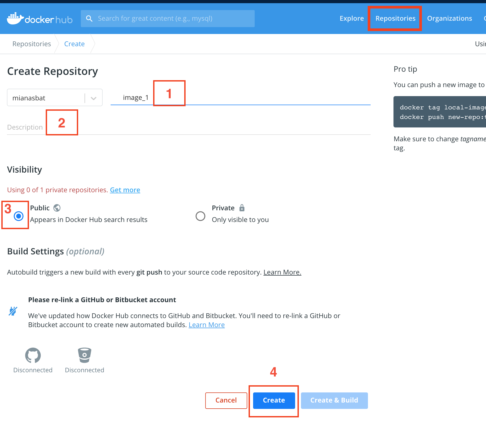

Share your image
================

The following steps are required to share your newly created docker image to docker registry. 

Create Dockerhub account
------------------------
`Docker hub`_ is one of the main docker registry to store your images. You can save multiple public images for free. 
To sign up to docker hub visit `here`_.

Make a note of your dockerhub account name because you will need it to login from terminal in a later step.

Create a repository
-------------------

#. Login to docker hub account online.

#. Click Repositories tab from the top bar.

#. Create a repository

   #. Give a name, better to give the same name as the image name e.g. `image_1` in our case.

   #. Give a description.

   #. Click Create to create the repo.

Compress image
--------------
On docker host (local computer), compress the image into `.tar` file for quick upload to dockerhub. The following command will create `.tar` file of your image in the current directory.

.. code:: bash

    docker save image_1 > image_1.ter
    ls

Tag your image
--------------

Now you need to tag your image to link it to your dockerhub account. The format is

.. code:: bash

    docker tag image_1 <dockerhub_username>/<image_name>:<tag_name>
    # e.g. 
    docker tag image_1 mianasbat/image_1:v1
    # To check images
    docker images

Login to dockerhub
------------------

On docker host login to your docker hub account from terminal by the following command and providing the password when requested.

.. code:: bash

    docker login
    enter dockerhub username
    enter password

Upload to dockerhub
-------------------

Finally to push it to dockerhub

.. code:: bash

    docker push <dockherhub_username>/image_nae:v1

.. _Docker hub: https://hub.docker.com/
.. _here: https://hub.docker.com/signup