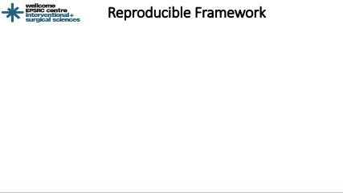

<!-- [](https://travis-ci.com/UCL/scikit-surgerydocker)  -->
[](https://scikit-surgerydocker.readthedocs.io/en/latest/?badge=latest)

# What is scikit-surgerydocker?
Scikit-surgerydocker is a template project that containerize (create docker image) Python project/algorithm. It specify the steps of how to share the project image with the world freely. It further explains how other users can download and execute image locally on their computer.    

If your project/algorithm is like any usual program i.e. gets input data, process it and produce results (as shown in the directory tree below) then you can use scikit-surgerydocker to containerize it for easy sharing and research reproducibility.




```
.
├── input_data
│   ├── file-1
│   ├── file-2
│   └── file-n
├── output_data
│   ├── result-1
│   ├── result-2
│   └── result-n
└── src
    └── application.py
```

To give a better idea of how it works, the documentation describes containerization of two example projects. First example shows the CPU program ([cpu-ex](https://github.com/UCL/cpu-ex)) and the second example shows the GPU program ([stereo-recon-example](https://weisslab.cs.ucl.ac.uk/ThomasDowrick/stereo-recon-example)). The documentation also explains how you can compress and upload your newly created docker images to a docker registry (dockerhub) for sharing with community. 

Another related project [scikit-surgerychallange](https://github.com/UCL/scikit-surgerychallenge) we are working on could be used to download the docker image from the cloud repository and run it on different dataset. This can be particularly useful for hosting efficiency of containerized algorithm by providing specific hardware resource (RAM size, CPU, Number and type of GPU's) and specific execution time to each docker image. Together the scikit-surgerydocker and scikit-surgerychallenge can be used to host research challenges.

## Documentation
The documentation of the project can be found on [readthedocs](https://scikit-surgerydocker.readthedocs.io/en/latest/).
