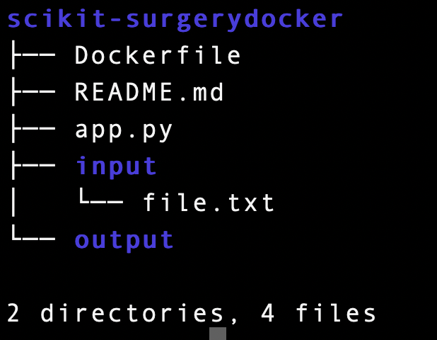

# scikit-surgerydocker
This repo describes with a simple example how to use docker to containerize your project/algorithm. Another related project [scikit-surgerychallange](https://github.com/UCL/scikit-surgerychallenge) could be used to host an algorithm challange after containerizing the project/algorithm according to this repository.  

## Step 1: Running the project before dockerization

Clone the repository
```
git clone git@github.com:UCL/scikit-surgerydocker.git
```
To run the python application directly
```
cd scikit-surgerydocker
python3 app.py
```
On execution the python program will (1) read the text file `inputfile.txt` from provided `scikit-surgerydocker/input` directory, (2) append more lines to the existing text and (3) store the whole text in a newly created file `outputfile.txt` in `scikit-surgerydocker/output` directory provided in the project. You can check the `outputfile.txt`

```
cd scikit-surgerydocker/output
cat outputfile.txt
```


## Step 2: Containerise this application

Now before containerization of your package, first you need to know about few import terms.    
`docker host:` The term refers to the machine on which docker is installed. E.g. in my case my Mac machine is my docker host.    
`docker image:` The term docker image have everything defined which we want in out container. It is just like a Class in Object Oriented Programming which defines what properties and behaviours an object of the class will have.
`guest machine / docker container:` This is the container which is created from the docker image. It is just like a Object in Object Oriented Programming which contains all the properties and behaviours that are defined in a class.
`Docker Engine:` This is the docker software that you must INSTALL and ENABLE/RUN on your `docker host` to run any docker command. You can install `Docker Engine` by following this [link](https://docs.docker.com/desktop/).

### Create a Docker image
To create a docker image, you will need a file called `Dockerfile`. It contains the specifications e.g. What Python version you want to run your python application with etc. Please read the `Dockerfile` in the repo for further information.

The directory structure after the cloning the project: 



Run the following command to create the image by the name `my-project`. You can your image any thing you want.   
**Note:** The following command will only work if you are in the same directory where the `Dockerfile` is stored. In our case `Dockerfile` is in the root directory of the repo.
```
cd scikit-surgerydocker
docker build . -t my-project
```
Run the following command to check that your docker image is created.
This command will show all the docker images you have on your docker host including the newly created `my-project` Docker image.
```
docker images
```
The newly created `my-project` image will have the Python version you specified in `Dockerfile` and the dependencies installed (if any) and finally the source code.

### Running the created image
After you have containerize your python application, you would like to run it :) The following command will create a new `container` from image `my-project`. 
```
cd scikit-surgerydocker
docker run \
    -v "$PWD/input:/project/input" 
    -v "$PWD/output:/project/output" 
    my-project
```

In the above command,      
`my-project` is the image name.     
`-v "$PWD/input:/project/input"` This parameter will mount the `scikit-surgerydocker/input` directory from docker host to `/project/input` directory in the container to make the input file availabe to our python `app.py` when executed in the container.      
`-v "$PWD/output:/project/output"` This will mount the `scikit-surgerydocker/output` directory from docker host to `/project/output` directory in the container. So when the `app.py` application on execution write to `/project/output` in the container, we will automatically get it on docker host in `scikit-surgerydocker/output` because of the mount.

### Verifying the creation of new container
You can verify the newly created container by running the following command on docker host.
```
docker ps -a
```
Check the status column and you will see that the status say `Exited`. It is because that the docker container exit after performing its job. In our case, its job was to read text from input file and append text with it and write to output file.


### Checking the output
To verify the processing performed in the container after executing the above run command. On docker host
```
cd scikit-surgerydocker
cd output
cat outoputfile.txt
```

### Step 3: how to package your image for sharing
If you would like to submit your docker image containing your Python application to a challange then this can be achieved in two common ways:

#### 3.1 Compress the image and upload it to cloud drive
This following command will create the compressed `tar` file of the image in the current directory by the name `my-project-team1.tar`.   

```
# You dont need to be in scikit-surgerydocker directory to do this. 
# The following command will work from any where in docker host

docker save my-project:team1 > my-project-team1.tar
```

Now you can upload this tar file to the cloud drive (Google drive, Drop box, One drive etc) and you can share it with any one you want.

#### 3.2 Upload it docker hub
One of the docker register where you can upload your created image `my-project` is [docker hub](https://hub.docker.com/). 
1. Create a free account in docker hub.
2. Login to docker hub account online.
3. Create a repository
    1. Give a name (e.g. new-user-1)
    2. Give a description
    3. Click Create.
4. Now on docker host login to your docker hub account from terminal by the following command and providing the password when requested.
```
docker login --username=yourgithubusername --email=youremail@company.com
```
5. Now you need to tag your image with your docker hub ID.
    1. To tag the image, first you need to find the image ID.
    2. After finding the ID you can tag the image
```
# 1. To find the ID of your image run command
docker images

# 2. To tag the image with your docker hub username
docker tag <image id found in step 1> yourgithubusername/my-project:team1
```
6. Now you can upload the tagged image to docker hub. It will take time in uploading depending on the size of the image.
```
docker push yourgithubusername/my-project:team1
```


